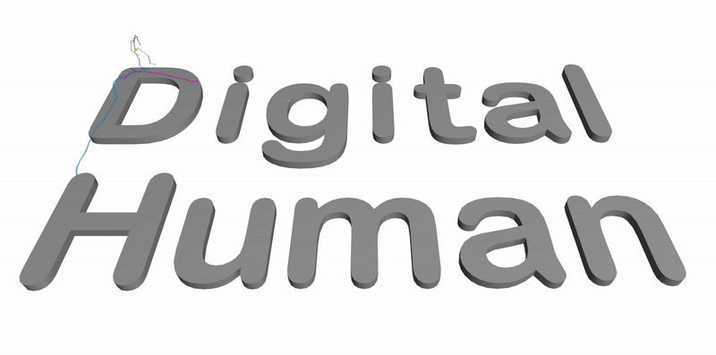
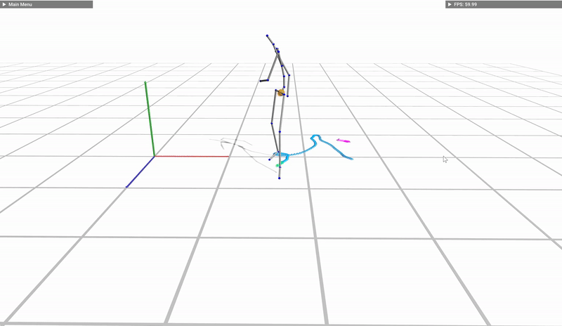

<p align="center">
  <h1 align="center">Motion Matching for Responsive Animation for Digital Humans</h1>
  <p align="center">
    <a href="https://github.com/DecAd3"><strong>Longteng Duan*</strong></a>
    ·
    <a href="https://github.com/guo-han"><strong>Guo Han*</strong></a>
    ·
    <a href="https://github.com/Ribosome-rbx"><strong>Boxiang Rong*</strong></a>
    ·
    <a href="https://github.com/Milkiananas"><strong>Hang Yin*</strong></a>
  </p>
  <p align="center"><strong>(* Equal Contribution)</strong></p>
  <h3 align="center"><a href="https://youtube.com/playlist?list=PLUffCQyBEYtYXr-pVqqUgSG1Ncxp4UzAb">Demo Videos</a> | <a href="https://github.com/Ribosome-rbx/Motion-Matching-for-Human-Skeleton/tree/main/resource/TEAM_6_Report.pdf">Report</a> | <a href="https://docs.google.com/presentation/d/13Kz_PvJAkfzi9m_gFjUCRpPG92N0RBROceEzudvjc8I/edit?usp=sharing">Slides</a></h3>
  <div align="center"></div>
</p>
<p align="center">
</p>
<br>

<p align="center">
  
</p>


<details open="open" style='padding: 10px; border-radius:5px 30px 30px 5px; border-style: solid; border-width: 1px;'>
  <summary>Table of Contents</summary>
  <ol>
    <li>
      <a href="#compilation">Compilation</a>
    </li>
    <li>
      <a href="#dataset">Dataset</a>
    </li>
    <li>
      <a href="#functionalities">Functionalities</a>
    </li>
    <li>
      <a href="#example-demos">Example Demos</a>
    </li>
    <li>
      <a href="#acknowledgement">Acknowledgement</a>
    </li>
  </ol>
</details>

## Compilation
The program is easy to compile using Visual Studio Code and CMake.

```
git clone https://github.com/Ribosome-rbx/motion-matching-demo.git
cd motion-matching-demo
mkdir build
cd build
cmake ..
make
```

Note that we will fetch repo [https://github.com/guo-han/motion-matching](https://github.com/guo-han/motion-matching) when building this project. Make sure to fetch the **most recent version** of master branch. Some of our developments are done in that repository.
## Dataset
The dataset we used for constructing matching database is [LAFAN1](https://github.com/ubisoft/ubisoft-laforge-animation-dataset). But you do not need to redownload and process the dataset yourself. All necessary data have been added into this directory under the `/data` folder.
## Functionalities
Users can control the digital character using keyboard control, drawed trajectory or human pose input from camera. Details are elaborated below.
### Keyboard Control
|Keys|Actions|
|:-:|:-:|
|W, S, A, D|controll the character's movement in eight directions (W, S, A, D, W+A, W+D, S+A, S+D)|
|up arrow key↑, down arrow key↓|increase, decrease the forward speed|
|Shift|sprint|
|J|jump|
|C|crawl|
|P|dance|
|Space|Pause Program|

### Drawed Trajectory
When checking the `Paint trajectory` box in the application UI, we can use mouse to draw a trajectory on the ground. Once paint a trajectory, keyboard control will be disabled, while you can still press "shift" to run. Then the character will follow a straight line to the nearest dot on the trajectory, and start following the whole trajectory. Once reaching the end, it will go straight back to the start point and do another round. To disable the trajectory control mode, click on the `Clear Painting` button and then you can turn back to keyboard control again.

<details>
  <summary>[Demo for drawed trajectory (click to expand)]</summary>

  

</details>

### Human Pose Control
Compile and run this application with another [script](https://github.com/Ribosome-rbx/pose-classifier-on-fastpose/blob/main/demo_2d.py) opened. You are only allowed to use 13 predefined poses to animate the character for several instructions, and the input is captured from laptop camera. More information can be found in this [repository](https://github.com/Ribosome-rbx/pose-classifier-on-fastpose).

We utilized [FastPose](https://drnoodle.github.io/fastpose_html/) to capture human poses. For the 13 motions, namely $\textit{crawl forward}$, $\textit{crawl left}$, $\textit{crawl right}$, $\textit{dance}$, $\textit{jump}$, $\textit{punch}$, $\textit{run forward}$, $\textit{run left}$, $\textit{run right}$, $\textit{stand still}$, $\textit{walk forward}$, $\textit{walk left}$, and $\textit{walk right}$, we pre-recorded 13 videos as the reference for the corresponding poses. Then, a kNN classifier is trained for pose classification. We employ a Python script to translate real-time human poses into keyboard input for program control. In running time, when a new pose is received from camera, we apply a KNN classifier to assign a label to the pose, and the script will give this application corresponding key down instruction to animate the digital character.

<details>
  <summary>[Demo for human pose control (click to expand)]</summary>

  

</details>

### Camera Trcking Mode
This mode is designed for "Human Pose Control", since one can no longer modify view directions by mouse. To use this mode, check the "Track Velocity" box in "Camera" hidden menu. Then, the window view will change following the velocity direction.


### External Terrain Object Loading
To run motion matching with different terrains, open the "Ground" hidden menu. Select from the drop down menu of "Terrain".


## Example Demos
Basic Square terrain
| walk |  run  |
| :------------------------------: |:------------------------------: |
|| |


| creep |  dance  |
| :------------------------------: |:------------------------------: |
| | |


<!-- 


 -->

Forrest terrain

| walk |  run  |
| :------------------------------: |:------------------------------: |
|| |


| jump |  creep  |
| :------------------------------: |:------------------------------: |
| | |

<!-- 


 -->


## Acknowledgement
This project was undertaken as part of the 2023HS digital human course at ETH Zurich. We would like to express our sincere appreciation for the valuable guidance and support provided by our supervisor, [Dongho Kang](https://donghok.me/).
